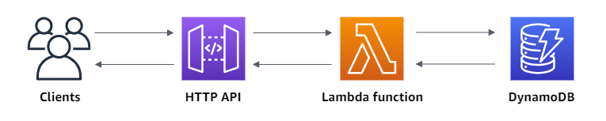

# API CRUD na AWS com Lambda e DynamoDB

## API serveless que cria, lê, atualiza e exclui itens de uma tabela do DynamoDB

### Projeto realizado para servir o site desenvolvido no desafio final do Hiring Coders 2021 da Gama Academy, VTEX, ACCT e AWS, realizado pelo grupo 16



### Tecnologias utilizadas:

- **Amazon DynamoDB**: é um serviço de banco de dados NoSQL totalmente gerenciado que oferece desempenho rápido e previsível com escalabilidade contínua.

- **AWS Lambda**: é um serviço de computação que permite executar código sem provisionar ou gerenciar servidores praticamente qualquer tipo de aplicativo ou serviço de back-end.
  
- **Amazon API Gateway**: é um serviço da AWS para criar, publicar, manter, monitorar e proteger APIs REST, HTTP e WebSocket em qualquer escala.

- **Javascript**

### Passos do desenvolvimento do Projeto:

  1. Criar uma tabela no DynamoDB pelo https://console.aws.amazon.com/dynamodb/ ;

2. Criar uma função do Lambda (index.js) pelo https://console.aws.amazon.com/lambda/ para o backend da API. Essa função do Lambda cria, lê, atualiza e exclui itens do DynamoDB. A função usa eventos do API Gateway para definir como interagir com o DynamoDB;

3. Criar uma API HTTP pelo https://console.aws.amazon.com/apigateway/ que fornece endpoints de HTTP para a função do Lambda;
  
4. Configurar rotas e integrações para conectar a API e a função do Lambda;

5. Anexar as integração a todas as rotas da API, a função do Lambda é invocada quando um cliente chama qualquer uma de suas rotas.

### Endpoints, rotas e métodos da API:

- Busca todos os leads - GET - {{url AWS}}/leads
- Busca lead por email - GET - {{url AWS}}/leads/{email}
- Cria lead - POST - {{url AWS}}/leads
  
  ```json
  Body
   {
    "nome": "nome do cliente",
    "id": "id do cliente",
    "email": "email do cliente",
    "telefone": "telefone do cliente",
    "cliente": false || true
    }
  ```
- Apaga lead por email - DELETE - {{url AWS}}/leads/{email}
- Atualiza lead por email - PUT - {{url AWS}}/leads/{email}
  ```json
  Body
  {
	"cliente": false
  }
  ```
### Links:
- [AWS Documentation](https://docs.aws.amazon.com/index.html "AWS Documentation")
  - [Amazon DynamoDB](https://docs.aws.amazon.com/dynamodb/index.html)
  - [AWS Lambda](https://docs.aws.amazon.com/lambda/index.html)
  - [Amazon API Gateway](https://docs.aws.amazon.com/apigateway/index.html)
- [MDN Web Docs](https://developer.mozilla.org/en-US/)
